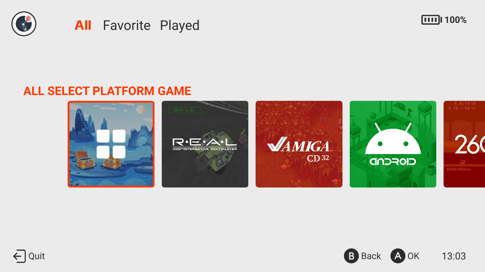
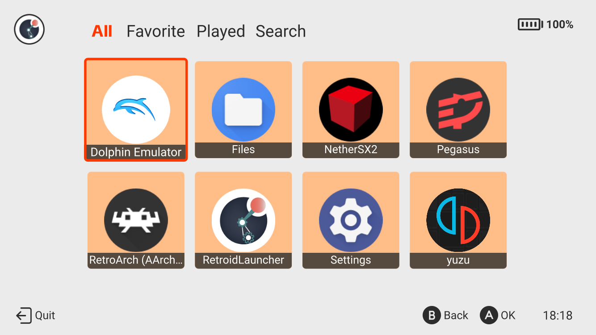
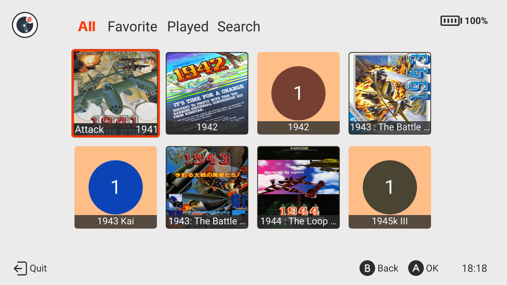
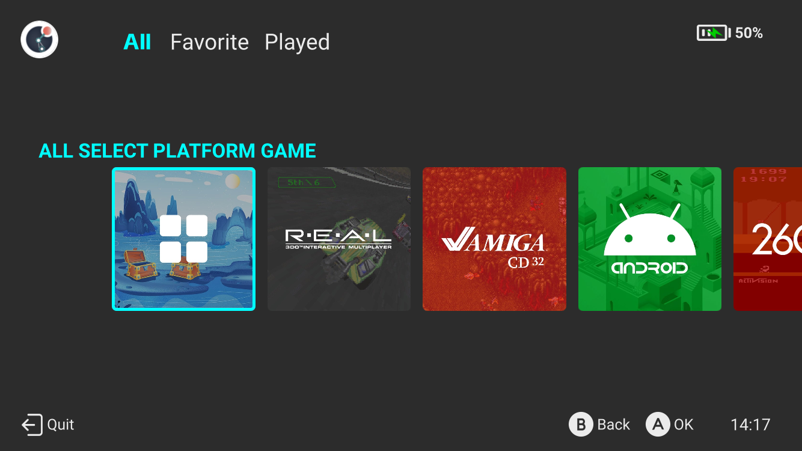
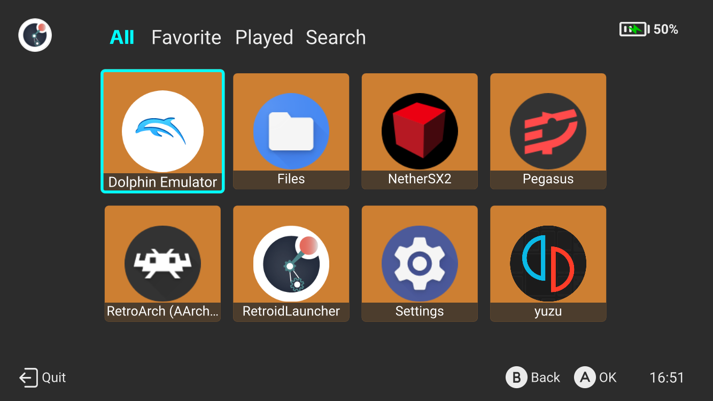
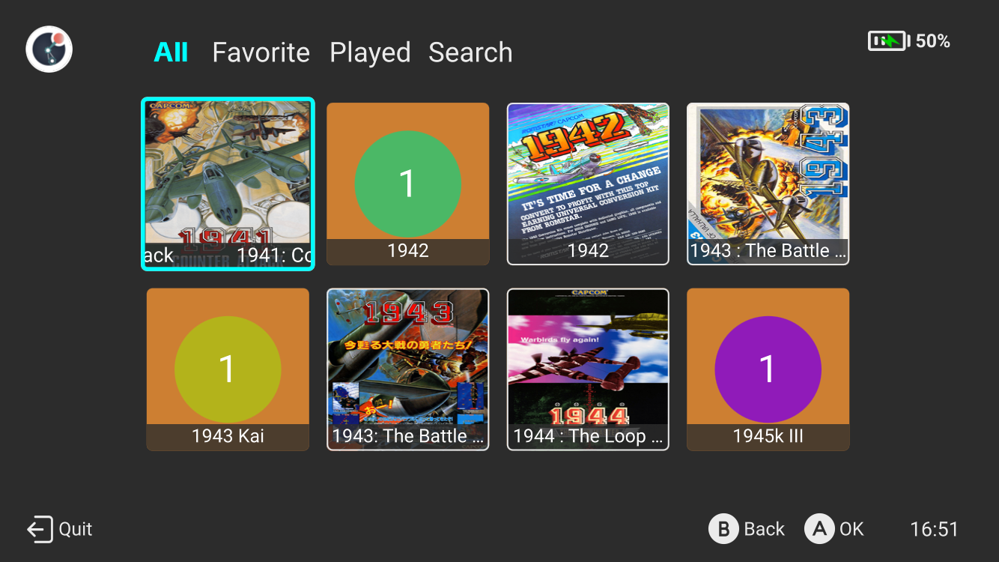

# Retroid Pocket Launcher Theme

Pegasus Frontend Theme optimized for Handheld. You need to have Pegasus installed in your handheld

**Is Compatible With 4:3 and 16:9 handhelds**

## Assets needed

For this theme you need the following media types from [skraper](http://skraper.net):

- screenshot
- wheel

## Theme Installation

1 Download in (https://github.com/ElectronicRave/rp-launcher/releases) or (https://pegasus-frontend.org/tools/themes/)

2 Unzip the downloaded file.

1 Upload the folder to /pegasus-frontend/themes/rp-launcher-main

4 Open Pegasus, go to Settings - General - Theme and select RP Launcher

## Home Screen

In the home screen you will find information about the battery level, charging status and current time

In the home screen you can navigate your Systems using your D-pad or use the touchscreen to:

- Access all contents
- Access to favorited contents
- Access your latest played contents
- Change theme color

### Theme Mode

- Press and hold profile icon to change theme color to Light/Dark

If you selected Dark Mode in the Home Page, the Game List will be presented in Dark Mode as well.

## Content Screen

In this list you can see all contents in the System, in this screen you can do several things by pressing different buttons:

- A  - Launch content
- B  - Goes back to the Home Page
- L1 - Previnious page
- R1 - Next page
- L2 - Previnious system
- R2 - Next system
- TOUCH - Access to All, Favorite, Played and Search
 
### Favorite mode

- Press and hold on the image of the content to add it to favorites.
- press and hold again to remove from favorites

### Search mode

Visible only on the current collection page!

Just click search in the current collection and write the name of the content.

Note:
- If you write the name of the content and press "enter" on the virtual keyboard it will show the corresponding items.
- If you want to search the entire system, click (All) and search again.
- If you press the back button "B" you will return to the home screen.
